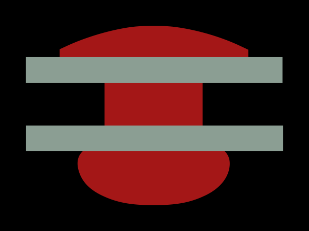

rivt
======

is an open source markup language and framework for writing and publishing
engineering documents. Markup syntax is described :doc:`here <Markup>`.
The framework is described :doc:`here <Installation>` and
:doc:`here <Folders>`. Input files are plain text Python and documents
may be output as utf8-text, PDF or HTML.

Table of Contents
------------------

.. toctree::
    :maxdepth: 1

    self
    Introduction.rst
    Installation.rst
    Markup.rst
    Docs.rst
    Folders.rst
    Report.rst
    Search.rst

