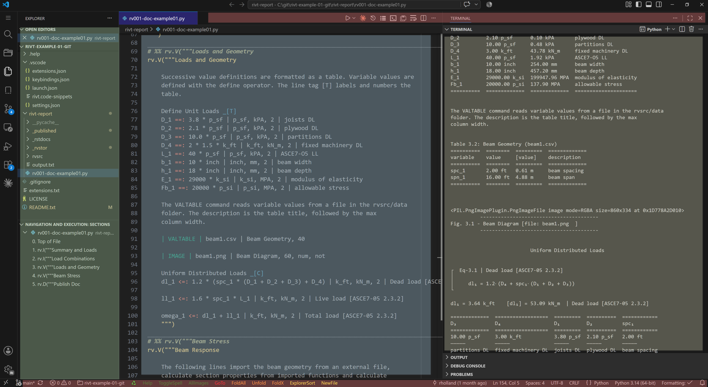
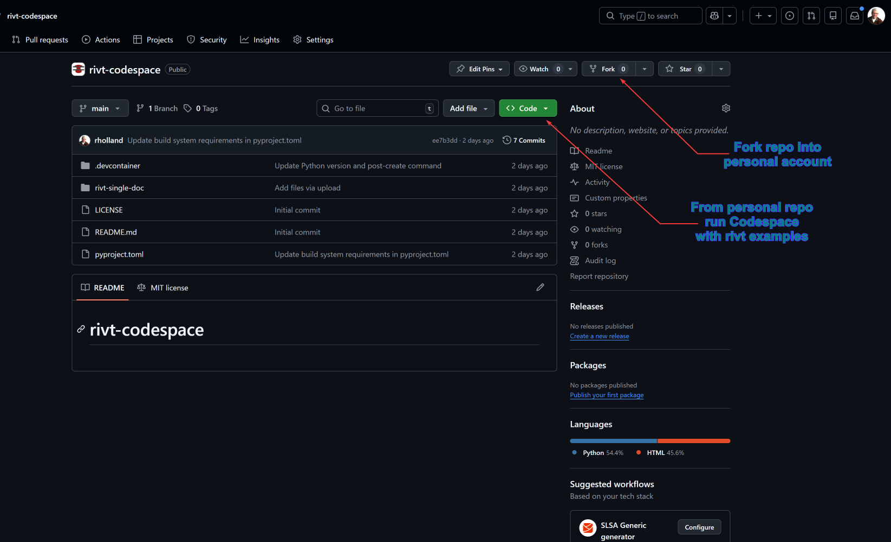

**A.1 |** Start
=====================================================================

.. _rivt-start:

**[1]** Getting Started 
------------------------------------------------------------------------------- 

This section covers installation of *rivt* and *rivt doc* examples. They are
source software so you are free to download and modify the program as needed 
(see :ref:`FAQ <Licenses>`). The open source software installation process is
designed to gather and install multiple open source components from
various sources. This section covers three ways to run *rivt*.

#. For most Windows users the best way to get started is to download
   the portable file *rivt-code.zip*  (~800 MB zipped, ~2.2 GB expanded). 
   For further details see :ref:`rivt-code <rivt-code>`.

#. For users with a `GitHub <https://github.com>`__ account or limitations
   on running local software, the best way to get started is to fork and run
   :ref:`rivt-codespace <rivt-codespace>` in a browser. 

#. For users familiar with Python, *rivt* may be installed at the system level
   or in an isolated environment using *uv*. Further details are 
   :ref:`here <rivt-sys>`.

*rivt* may be edited in a simple text processor and run from the command line 
but efficient editing and compiling is typically done in an :term:`IDE`. Any IDE 
may be used but *VSCode* with extensions is supported and documented. 
A typical **VSCode IDE** layout for editing a *rivt file* is shown below.

    rivt files and docs in **VSCode** (click on image to enlarge)

.. note::

    The :ref:`rivt file <file-folder>` is in the center editing panel[blue], the 
    :ref:`text doc <rivt-docs>` output is in the right panel[brown] and the
    *file explorer* is the far left panel [green]. Extension buttoms are
    located on the top and bottom status bars [red]. Text, PDF and HTML output
    files are accessed in the file explorer and displayed within panels.
    Individual *rivt* sections are linked in the navigation panel and in the
    text output for quick naviagation through the file. Panel locations may be
    customized by the user. An example *rivt file* and *doc* are
    :ref:`here <rivt-tutor>`.

-------------------------------

.. _rivt-code:

**[2]** rivt-code
-------------------------------------------------------------------------------- 

A *rivt-code* installation is recommended for Windows users interested in trying
*rivt* *rivt-code* is a zip file that includes rivt, Python, VSCode and an
example rivt file. The zipped file size is ~800 MB which unzips to about 2.2
GB. It may be downloaded from the `rivt-code repository
<https://github.com/rivtlib-dev/rivt-code/releases/>`__.

The zip file naming convention is:

.. code-block:: text

    rivt-code-monthx.year.zip

where x is an a-z character representing mid month releases. 

The tag name follows the major, minor and patch release number convention.

.. code-block:: text

   v<major>.<minor>.<patch>[an]

The zip file contents must be unzipped into a directory with read-write access
- typically the users home folder or a flash drive. After unzipping, click the
*rivt-code* shortcut to open the example rivt file in a rivt VSCode
environment. Click on the triangle in the upper right of the editor to run the
file and output text, pdf or html docs, depending on the | PUBLISH | setting.
See the rivt user manual for details.

Features of *rivt-code* include:

#. simplified, isolated installation
#. package and framework integration
#. installation generally needs to be updated as a whole, not the individual components. 
#. integration with other programs may be more difficult. 

*rivt-code* includes preinstalled VSCode extensions designed to simplify editing 
navigation and running *rivt files*. They are listed in :ref:`vscode settings 
<vscode-settings>` and may explored and modified in the VSCode interface. 

-------------------------------

.. _rivt-codespace:

**[3]** rivt-codespace
-------------------------------------------------------------------------------- 

`VSCode <https://code.visualstudio.com/>`_ is a customizable code editor that
can be run locally or in the cloud. The cloud version of *VSCode* is referred
to as a `Codespace <https://github.com/features/codespaces>`__ . A 
:term:`rivt Codespace` is a *VSCode* cloud environment with *rivt* extensions 
for editing and running *rivt files*. 

Codespaces are run in a personal GitHub account. When rivt-codespace is forked
into a personal account and run, an example rivt file is loaded. The example
file may be run and edited in the Codespace and the rivt interface extensions
may be explored.

The first time a rivt-codespace is run, it may take a few minutes to load and
initialize the environment. After it is set up, it will load in a few seconds.
The same delays apply to running a rivt file. The first time will be a minute
or two to compile the Python files. Subsequent runs will be a few seconds. The
rivt-codespace environment is persistent and will save any changes made to the
example files.

Steps for running rivt-codespace are provided in the README `here
<https://github.com/rivtlib-dev/rivtlib>`__.

-------------------------------

.. _rivt-sys:

**[4]** rivt-system
--------------------------------------------------------------------------------

*rivt* may be installed into a system level Python. 

.. topic:: Step 1. Install Python

    Install Python using `Python installers <https://www.python.org/downloads/>`__
    if not already installed. The minimum required version is Python 3.14.

.. topic:: Step 2. install rivtlib and dependencies

    Install *rivtlib* and dependencies using pip

    .. code-block:: bash

        pip install rivtlib
    
A list of the installed dependencies is :ref:`here <rivt-depend>`.

*rivt* may also be installed and isolated environment using the `uv package
manager <https://docs.astral.sh/uv/>`__. The primary advantage of *uv* is the
simplicity of insalling and updating packages while keeping them isolated from
the system Python. 

*rivt-uv* installation is recommended for users with some familiarity with
Python and programming.

.. topic:: Step 1. Install uv

    Different methods for installing *uv* are described
    `here <https://docs.astral.sh/uv/getting-started/installation/#pypi>`__. 

    The recommended method for installing *uv* is from the command line:

    Windows:

    .. code-block:: bash
        
        winget install --id=astral-sh.uv  -e

        or

        powershell -ExecutionPolicy ByPass -c "irm https://astral.sh/uv/install.ps1 | iex 

    macOS and Linux:

    .. code-block:: bash
        
        curl -LsSf https://astral.sh/uv/install.sh | sh

.. topic:: Step 2. Create the rivt environment

    After installing *uv*, the following rivt install scripts
    will install an isolated *rivt environment*  folder named *rivt-start* 
    in the users *Home* directory.

    Windows:  :download:`rivtuv.cmd </_downloads/rivtuv.cmd>` 

    OSX and Linux: :download:`rivtuv.sh </_downloads/rivtuv.sh>`

    The uv environment can be completely removed with the following commands.

    .. code-block:: bash

        uv deactivate
        rmdir /s /q rivt-examples
        uv cache clean
    
.. topic:: Step 3. Download example rivt report folders

    Example folders can be downloaded and unzipped through
    `openmodels.info <https://www.openmodels.info>`__ or directly from  
    `Google Cloud <https://drive.google.com/drive/u/1/folders/1NP04tdp3FRAir0ErvL2hlm3YBaFlLk5V>`__ .

    *rivt* also includes the `Pyzo <https://pyzo.org/>`__ IDE for editing and
    running examples. Pyzo may be configured in the uv environment and
    provides an effective environment for running rivt examples. 
        
---------------------------------

.. toctree::
    :maxdepth: 1
    :hidden:

    rvA02-tutor.rst
    rvA03-exfile.rst
    rvA04-txt.rst
    rvA05-html.rst
    rvA06-pdf.rst
    rvA07-faq.rst