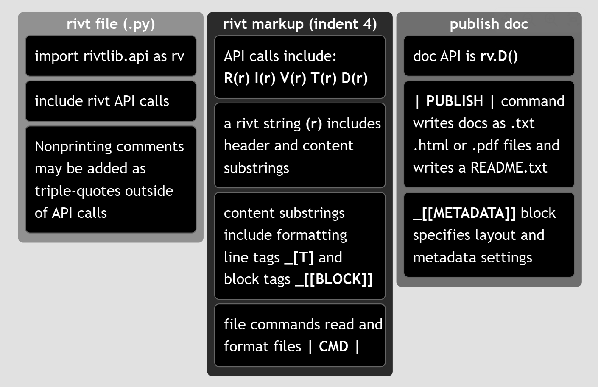

**A.2 | Tutorial**
=========================

.. _rivt-tutor:

**[1]** rivt file Anatomy 
-----------------------------------------------
 
This chapter provides a step by step tutorial for creating a rivt file and
compiling it to a doc. The table below shows the basic rivt file structure and
its relationship to Python. The resulting txt, PDF and HTML docs generated by the 
| PUBLISH | command are shown in the following chapters.

The first column shows the Python content of the rivt file. A *rivt file*
includes the *import statement*, *rivt API methods* with markup and any
triple quoted comments. These file components are Python syntax and are not
indented.

The second column describes the contents of an *API method*, including *rivt
markup* and plain text. *API methods* always write formatted text to STDOUT
and may be run as interactive cells in an IDE e.g. VSCode.

The third column describes the *Doc API* method which contains settings
that trigger publication of a *doc* in one of the three formats.

The example file used in this tutorial, along with other report and rivtbook 
example files, are provided at 
`google drive <https://drive.google.com/drive/u/1/folders/1NP04tdp3FRAir0ErvL2hlm3YBaFlLk5V>`_. 

#. Example 1
    An example file that illustrates common API functions and rivt
    markup. The %% marks provide cell level navigation in a side pane of 
    VSCode and may be auto inserted with keystrokes when the *rivt profile* is 
    used.

#. Example 2
    An example that illustrates the use of Python functions.

#. Example 3
    An example *rivt report*.  Reports are assembled through a 
    report script - *make-report.py* stored in the *rivt-report* folder.

#. Example 4
    An example *rivtbook*. *rivtbooks* are collections of rivt files
    with a common subject matter organized for efficient selection and 
    inclusion in docs and reports.

The four examples provide: 

- the rivt file with source files
- published docs in each format
- the README.txt file

**[2]** tutorial - Example 1
-----------------------------------------------

*rivt files* can be created from scratch as a *.py* file or by making a copy
and editing an existing rivt file. The rivt file contents for this example are
shown in the dropdowns. The complete file is :ref:`here <example-file>`.

Unit definitions are :ref:`here <unit-definitions>`. New units may be defined
by the *add-units.py* file in the *rvsrc/scripts* folder.

After initialization, any API can be used any number of times and in any order,
except for rv.D(r) which stops file processing and triggers a doc output with
the **| PUBLISH |** command.

.. dropdown::  [ 1 ] Add import statement 

    Following the import statement, comment settings may be added if defaults
    need to be changed. In addition, triple quoted comments can be added
    between API methods. They are not indented and are not part of the doc.
                
    .. code-block:: python

        """ This is a rivt doc example.  It is used in the tutorial at 
        https://www.rivt.info. .

        This example illustrates: 

            rivtlib markup
            - Multiple API sections (chapters)
            - Footnotes
            - Inline comments
            - Url links
            - Variable definitions
            - Table blocks and commands
            - Value table command
            - Metadata and layout block
            - Python function command
            - Image command
            - Publish command

            VSCode / Python features
            - cell labels
            - docstrings
            - extensions

        """

        import rivtlib.rvapi as rv

        # cooment settings are only needed if defaults are changed.
        # rv set_width = 80  ; character width of text output (80)
        # rv no_tag = true ; if false, the API type is added to section number (true)
        # rv private = true ; if false, default section heading changed to public (private)

.. dropdown:: [ 2 ] Add API method - rv.I

    See :ref:`header <Header substring>` and 
    :ref:`content <Content substring>` reference for rivt string details. 
    This section includes :ref:`footnote [#]  and link [U] tags <line summary>`.

    .. code-block:: python

        # %% rv.I("""Summary and Loads
        rv.I(r"""Summary and Loads

            This rivt file example calculates the maximum stress and deflection in a
            simply supported, uniformly loaded beam using E-B theory _[#]. It also
            serves as an annotated example of a single rivt doc with multiple sections
            that is not part of a report.

            The example illustrates the use of some of the most common API functions,
            commands and tags. Further details are provided in the 
            _[U] rivt user manual, https://www.rivt.info |.

            The file may be formatted as a text, PDF or HTML doc by changing the type
            parameter in the PUBLISH command at the end of each rivt file (Doc-API
            *rv.D*). Published files are found in the _published folder.
        """)

.. dropdown:: [ 3 ] Add API method - rv.I
    
    This section includes inline comments ( ## ) and 
    :ref:`[[TABLE]] blocks <block summary>`. The **# %%** marks provide 
    interactive execution and file navigation in a side pane of VSCode and 
    may be auto inserted with keystrokes when the *rivt profile* is used.
                 
    .. code-block:: python

        # %% rv.I("""Load Combinations 
        rv.I(r"""Load Combinations 

            ## Comments with double hashes will not appear in the doc
            
            Dead and live loads effects are taken from ASCE 7-05 _[#]

            _[[TABLE]]  Load Effects 
            ============= ================================================
            Equation No.    Load Combination
            ============= ================================================
            16-1           1.4(D+F)
            16-2           1.2(D+F+T) + 1.6(L+H) + 0.5(Lr or S or R)
            16-3           1.2(D+F+T) + 1.6(Lr or S or R) + (f1L or 0.8W)
            ============= ================================================
            _[[END]]
        """)

.. dropdown:: [ 4 ]  Add API method - rv.V
    
    This Value section includes the | VALTABLE | and | IMAGE | 
    :ref:`commands <command-summary>`, the _[C] and _[T] :ref:`tags <line summary>`, 
    and the :ref:`assignment operators <assign-summary>` **==:** and **<=:** .

    .. code-block:: python

        # %% rv.V("""Loads and Geometry
        rv.V(r"""Loads and Geometry 
            
            Value definitions are formatted as a table. Variable values are
            defined with the define operator. The line tag [T] labels and
            numbers the table. Units are listed here. New units may be defined
            in the add-units.py file in the rvsrc folder.
            
            Define Unit Loads _[T]
            D_1 ==: 3.8 * p_sf | p_sf, kPA, 2 | joists DL         
            D_2 ==: 2.1 * p_sf | p_sf, kPA, 2 | plywood DL          
            D_3 ==: 10.0 * p_sf | p_sf, kPA, 2 | partitions DL       
            D_4 ==: 2 * 1.5 * k_ft | k_ft, kN_m, 2 | fixed machinery DL
            L_1 ==: 40 * p_sf | p_sf, kPA, 2 | ASCE7-O5 LL
            b_1 ==: 10 * inch | inch, mm, 2 | beam width
            h_1 ==: 18 * inch | inch, mm, 2 | beam depth
            E_1 ==: 29000 * k_si | k_si, MPA, 2 | modulus of elasticity
            Fb_1 ==: 20000 * p_si | p_si, MPA, 2 | allowable stress   
            
            The VALTABLE command reads variable values from a file in the rvsrc
            folder. The description is the table title, followed by the max
            column width. 

            | VALTABLE | rvsrc/beam1.csv | Beam Geometry, 40

            ## The IMAGE command inserts an image file with caption, % scale, num;non option 
            | IMAGE | rvsrc/img/beam1.png | Beam Diagram, 60, num, not

            Uniform Distributed Loads _[C]
            dl_1 <=: 1.2 * (spc_1 * (D_1 + D_2 + D_3) + D_4) | k_ft, kN_m, 2 | Dead load [ASCE7-05 2.3.2]

            ll_1 <=: 1.6 * spc_1 * L_1 | k_ft, kN_m, 2 | Live load [ASCE7-05 2.3.2]
            
            omega_1 <=: dl_1 + ll_1 | k_ft, kN_m, 2 | Total load [ASCE7-05 2.3.2]
            """)

.. dropdown:: [ 5 ] Add API method - rv.V 

    This Value section includes the | PYTHON |  and | IMAGE2 | 
    :ref:`commands <command-summary>`, the _[B] and _[M] :ref:`tags <line summary>`, 
    and the :ref:`assignment operators <assign-summary>` **:=:** and **<=:** . 

    .. code-block:: python

        # %% rv.V("""Beam Stress
        rv.V(r"""Beam Response

            The following lines import the beam geometry from an external file, 
            calculate section properties from imported functions and calculate 
            the maximum moment, bending stress and mid-span deflection. 

            | PYTHON | rvsrc/scripts/sectprop.py | Beam functions

            section_1 :=: rectsect(b_1, h_1) | in3, cm3, 2 | rectangle - S (sectprop.py)

            inertia_1 :=: rectinertia(b_1, h_1) | in4, cm4, 1 | rectangle - I (sectprop.py)

            | IMAGE2 | rvsrc/img/ss-beam2.png, rvsrc/img/ss-beam1.png | Moment diagram, Deflection diagram,46,54,num,num

            Maximum bending stress formula _[B]
            
            ##  The line tag [M] formats the equation using utf-8 text.
            σ1 = M1 / S1 _[M]  
                
            m_1 <=: omega_1 * spn_1**2 / 8 | ftkips, mkN, 2 | Mid-span UDL moment 
            
            fb_1 <=: m_1 / section_1 | p_si, MPA, 1 | Bending stress 

            fb_1 < Fb_1 | k_si, 2, OK, >>> NOT OK | Stress ratio 

            delta_1 :=: midspan_delta(spn_1, omega_1, E_1, inertia_1) | inch, mm, 2 | mid-span deflection (sectprop.py)
            """)

.. dropdown:: [ 6 ] Add API method - rv.R

    The **Run API** does not use commands or tags in the *content substring*.
    The **header substring** includes a type parameter identifying the content
    text or script. In this example the API is used for endnotes. See :ref:`rv.R
    Markup <markup-R>`.

    .. code-block:: python

        # %% rv.R("""doc notes | endnotes
        rv.R(r"""doc notes | endnotes
            "Euler-Bernoulli beam theory", Wikipedia, Wikimedia Foundation. [Online].
            https://en.wikipedia.org/wiki/Euler_Bernoulli_beam_theory. 
            [Accessed: Jun. 15, 2026].

            ASCE/SEI 7-05, Minimum Design Loads for Buildings and Other Structures,
            American Society of Civil Engineers, 2005.
            """)

.. dropdown:: [ 7 ] Final API method - rv.D
    
    The Doc API publishes formatted *docs* and then exits the rivt file. The
    primary command is the **| PUBLISH |** command which specifies the doc title
    and type. The primary tag is the **_[[METADATA]]** block which includes the 
    *doc* [metadata] and [layout] settings. The **| PDFATTACH |** command may 
    be used to attach a PDF file to the doc. See :ref:`rv.D Markup <markup-D>`.

    .. code-block:: python

        # %% rv.D("""Publish Doc 
        rv.D(r"""Publish Doc 
            
            A rivt file may be published as a text, PDF or HTML doc by specifying 
            the PUBLISH type parameter as txt, pdf or html. 
            
            Published files are found in sub-folders of the _published folder. A 
            text version of the doc or report is is always written to 
            STDOUT (terminal) and the rivt and _rivt-public folders as a 
            README.txt file. READMEs are formatted and displayed on the first 
            page of a GitHub repo.
            
            | PUBLISH | Example 1 - rivt Doc | pdf
            
            _[[METADATA]] 
            [doc]
            authors = R Holland
            version = 1.0.0a12
            repo = https://github.com/rivt-info/rivt-single-doc
            license = https://opensource.org/license/mit/
            copyright = -
            fork1_authors = -
            fork1_version = -
            fork1_repo = -
            fork1_license = https://opensource.org/license/mit/
            
            [layout]
            subtitle =  UDL Beam
            copyright = --
            client = Attn: User Example
            coverpage = true
            coverlogo_size = 30
            coverlogo = logo1.png
            runninglogo = logo2.png
            runninglabel = rivt
            project_ref = proj. 0001
            pdf_pagesize = letter
            pdf_margins = 1in, 1in, 1in, 1in 
            pdf_link_underline = false
            ; colors - red, blue, green, yellow, black, gray, brown
            ; lightblue, magenta, lime, maroon, gray, olive, cyan
            pdf_link_color = brown
            ; toc levels: 1 - includes subdivisions, 2 - also includes sections
            toc_level = 2

            [process]
            doc_verbose = true; if false minmize output during doc processing
            auto_cfg = true ; if false, config files are not updated from rivt file
            _[[END]]    
            """)
