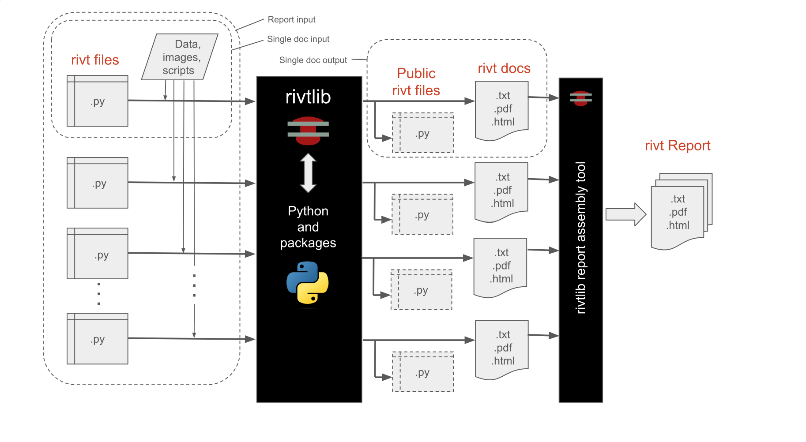

**B.1 | Overview**
=================================  

.. _rivt-overview:

**[1]** Summary
--------------------------------------------------------------------- 

*rivt* was designed to facilitate the creation of engineering calculation
documents from a wide variety of sources including external engineering
programs, data files, Python scripts, image files and single purpose programs
like Excel, Mermaid, Graphviz, and LaTeX. It accomplishes this using four API
functions:

.. raw:: html

    

    <b>R():</b> Runs external binary programs  

    <b>I():</b> Inserts static sources e.g. images, text, and PDF files  

    <b>V():</b> Imports data and calculates values from equations and functions  

    <b>T():</b> Processes text and scripts, e.g. restructured text, Python, LateX.   

       

For further API details see :ref:`here <rivt-api>`.

*rivtlib* is a Python library that compiles a *rivt file* to a text, PDF or HTML
document. A *rivt file* is a Python file (.py) that imports the *rivtlib*
Python package. The *rivtlib* package includes API functions that implement
*rivt markup*. *rivt* is an open source Python project built around the
`rivtlib Python package <https://pypi.org/project/rivtlib/>`__ and
`:ref:dependencies <vscode-settings>`. It publishes a formatted :term:`rivt
doc` as a text, PDF or HTML file. from a :term:`rivt file` - a Python file
(.py) that imports the :term:`rivtlib` Python package. *rivtlib* includes rivt
API functions that implement :term:`rivt markup`.

Groups of *rivt files* may be compiled and linked into a single 
:term:`rivt report`. Collections of *rivt files* with related subject matter 
may be grouped together as a :ref:`rivtbook <rivt-books>`. *rivtbooks* are 
organized for direct *rivt file* selection and insertion into 
*rivt docs* and *reports*

*rivt files* are generally edited and run in an IDE. The lightweight 
`Pyzo <https://pyzo.org/>`__ IDE is installed with rivtlib. The 
`VSCode IDE <https://code.visualstudio.com/>`__ is a full featured IDE that 
is part of the basic :ref:`rivt framework` and included  with the 
:ref:`rivt-code` installable.

*rivt file* examples are illustrated :ref:`here <rivt-tutor>`. Additional  
*rivt files* may be downloaded from *Google Drive* at 
`OpenModels.info <https://www.openmodels.info/>`__.  An interface for searching 
*public rivt files* on *GitHub* is :doc:`here <rvE02-github>`. 

A *public rivt file* is a subset of a *rivt file*, made up of sections the
author chooses to share under an `Open Source license
<https://opensource.org/licenses>`__. *rivt* is designed to seamlessly extract
public files, allowing the author complete discretion in choosing which file 
sections to make public.

*rivt* is distributed under the
`MIT open source license <https://opensource.org/license/mit>`__. 
(see:ref:`Licenses`).

.. _rivt-docs:

**[2]** Docs
-------------------------------------------------------------------------------

.. rst-class:: center

    **rivt Doc Processing**

Each :term:`rivt file` outputs a corresponding :term:`doc` of the format
specified in PUBLISH command of the *rv.D()* API. A rivt file number has the
form:

.. code-block:: text

    rvAnn-filename.py

where rvAnn is a required file number prefix with A an alphanumeric character and nn a two
digit non-negative integer. Corresponding rivt docs are output as:

.. code-block:: text

    rvAnn-filename.txt, pdf or html

A *rivt report* is organized using the *file numbers*. The file numbers are
used to organize reports into divisions and subdivisions. Each *rivt file* or
*doc* is a report subdivision. If the *rivt filenames* are:

.. code-block:: bash

    rvA01-filename.py
    rv105-filename.py
    rv212-filename.py  

the corresponding *doc numbers* in a report would be: 

- A.1 (division A, subdivision 1)
- 1.5 (division 1, subdivision 5)
- 2.12 (division 2, subdivision 12)

--------------------------------

.. _rivt-api:

**[3]** API
------------------------------------------------------------------------------- 

The *rivt API* includes :ref:`API functions <API functions>`, 
:ref:`markup` and structured :ref:`folders and files <Files-folders>`.  

The API and markup are designed to be:

- lightweight
    :term:`rivt markup` wraps :term:`reStructuredText` and uses fewer than
    three dozen tags and commands. *rivt* tags format lines or blocks of text 
    and commands read and write files.

- extensible 
    *rivtlib* is written in Python with direct access to the large 
    library of Python packages and functions. Python scripts and external 
    programs can be integrated into a *rivt doc*.

- versatile 
    A *rivt file* produces a text, HTML or PDF *doc*. Multiple *docs* can be 
    organized into reports. *rivtbooks* provide a convenient way to organize files
    around a subject matter. *rivt* can be run within a variety of IDEs.

- efficient
    The file and folder settings produce clear, organized documents with 
    default settings. Settings may also be customized for specific needs.

The API functions are listed in the table below, where (rS) is a triple quoted 
:term:`rivt string` argument.

================= =============== ================================================
API Function         Name             Purpose
================= =============== ================================================
**rv.R** (rS)         Run          Run external programs
**rv.I** (rS)         Insert       Insert static sources 
**rv.V** (rS)         Values       Calculate values
**rv.T** (rS)         Text         Process text and scripts
**rv.D** (rS)         Doc          Publish docs 
**rv.S** (rS)         Skip         Skip section 
**rv.X** ()           Exit         Exit rivt file
================= =============== ================================================

An API function starts in the first column and takes a triple quoted
:term:`rivt string` argument containing a :term:`header substring` and
:term:`rivt markup`. The first line of the *rivt string* is the header
substring, followed by a :term:`content substring` indented 4 spaces for
improved readability and section folding. 

The *header substring* specifies the section title and other processing
parameters. The content substring includes :term:`rivt markup` and arbitrary
text. For further details see :doc:`here <rvD01-markup>`.

**API Function Syntax**

.. code-block:: python

    rv._(r"""Section Label | parameters

         Content text that is 
         indented four spaces.
        
        ...
        
        """)

--------------------------------

.. _Files-folders:

**[4]** Files / Folders
------------------------------------------------------------------------------- 

A :term:`rivt file` is a Python plain text file ( *.py* ) that includes API
functions and imports the :term:`rivtlib` package into the *rv*
:term:`namespace`:

.. code-block:: python

    import rivtlib.rvapi as rv

*rivt files* are stored in either a *rivt* or *rivtbk* folder. Each *rivt file*
and corresponding *rivt doc* has a prefix used for document organization. The
top level folder structures are shown below. The difference in folder structure
facilitates copying chapters from rivtbooks into report. A more detailed
description of the folder structure is :ref:`here <report-folders>`.

    

    <b>Folder Names</b> 
     
    
    A report folder can contain any set of files and folders but the following
    structure is required for <i>doc</i> processing. Files and folders are
    organized under a root folder with the prefix <i>rivt-</i> e.g.
    <i>rivt-Report-Label</i>.    
    
    <i>report folders</i> (root folders) include at least the <i>rivt files</i> 
    and the five required subfolders. Required folders and prefixes are 
    shown in brackets. Folders preceded by an underscore contain rivt outputs. 
    Folders requiring author input are capitalized.    

The top level folder structure is shown below. A more detailed description of
the folder structure is :ref:`here<rivt-report>`.

.. code-block:: bash
    
    Top Level Folders

    Report Folders

    [rivt-]Report-Label/           Report Folder                
        ├── .help/                     help files
        ├── .vscode/                   optional VSCode settings 
        ├── [_rivt-public]/            rivt-generated public files
        └── [README.txt]               text doc or report
            ├── [rvsrc]/                    source files
            ├── [README.txt]                public text report or doc
            ├── [rv-101-]filename1.py       public rivt file
            ├── [rv-102-]filename2.py       public rivt file       
            ├── [rv-201-]filename3.py       public rivt file          
            ...
        └── [rivt-report]/               rivt files and docs               
            ├── [_published]/               published docs and reports
            ├── [_rstdocs]/                 rivt generated rst files               
            ├── [rv_stor]/                  rivt generated stored files
            ├── [rvsrc]/                    author source files
            ├── [rivt-]report.py            report generating script
            ├── [rv101-]filename1.py        rivt file
            ├── [rv102-]filename2.py        rivt file       
            ├── [rv201-]filename3.py        rivt file          
            ...    

    rivtbook Folders

    [rivtbk-]Book-Label/            rivtbook folder
        ├── .help/                      help files
        ├── .vscode/                    optional VSCode settings   
        ├── [README.txt]                rivt-generated book as text
        ├── [_rivtbk-public]/           public subset of rivt files           
        ├── [_rstdocs]/                 restructured text files
        ├── [_pdfdocs]/                 PDF docs and report         
        ├── [rvbk101-]folder name       rivtbook folder
        ├── [rvbk102-]folder name       rivtbook folder        
        ├── [rvbk201-]folder name       rivtbook folder           
             ...            

--------------------------------

.. toctree::
    :maxdepth: 1
    :hidden:

    rvB02-motivation.rst
    rvB03-framework.rst
