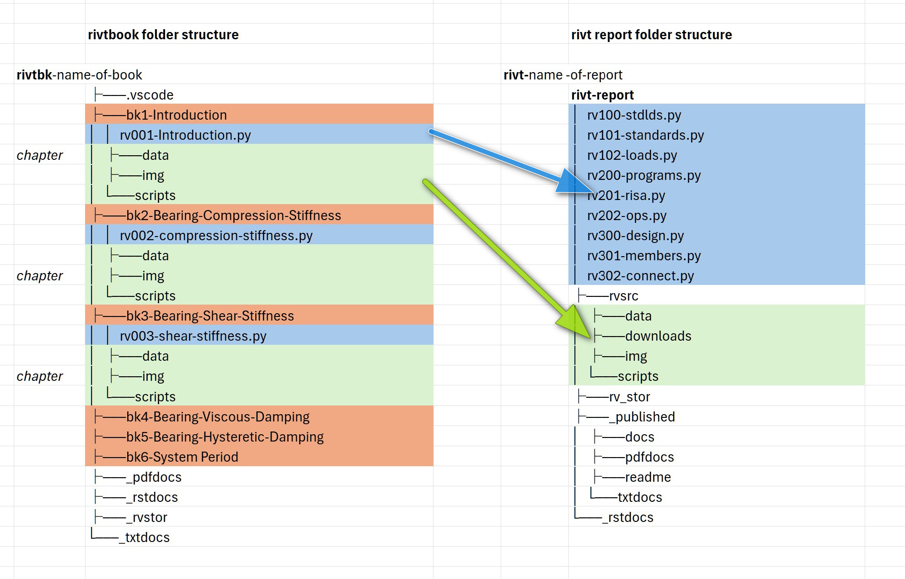

**C.4 | rivtbooks**
============================================

.. _rivt-books:

**[1]** rivtbooks
----------------------------------------------------------

A :term:`rivtbook` collects *rivt files* sharing a common theme under a folder
structure that allows direct copy and paste into *rivt docs* and *reports*. 
Its primary purpose is as an organized collection of files that can be
directly selected and copied/merged as shown in the diagram below.

A *rivtbook* may be printed as a PDF, txt and README.txt file for review and
exploration by using the *rivtbook-report.py* script.

**[2]** rivtbook Folder
----------------------------------------------------------
 
 
A typical :term:`rivtbook folder` structure is shown below. The required 
*rivt file* names and prefixes are shown in brackets. For the 
:term:`report folder` structure see :ref:`see <rivt-report>`.

.. raw:: html

    

    <b>Folder Naming</b> 
     

    A rivtbook folder can contain any file or folder but the following structure is
    required for <i>rivtbook</i> processing. <i>rivtbook folders</i> include at 
    least the folders and files shown in brackets[] below. Folders with an 
    underscore contain rivt generated files. Files and folders are organized under
    a <i>rivtbk</i> root folder with the prefix <i>rivtbk-</i> followed by the 
    rivtbook label, e.g. <i>rivtbk-Book-Label</i>.    

    A new <i>rivtbook folder</i> is typically started by copying and editing a
    similar folder. Several <i>rivt-folder</i> examples can be downloaded at 
    <a href="https://drive.google.com/drive/folders/1hwVOs0CVJqdZlTieV_Lt5bICbd3ywzWj?dmr=1&ec=wgc-drive-%5Bmodule%5D-goto">openmodels.info</a>.
       

<<<<<<< HEAD
=======
**rivtbook Folders**

.. code-block:: bash

    [rivtbk-]Book-Label/             rivtbook report folder              
        ├── .help/                        help files
        ├── .vscode/                      optional VSCode settings   
        ├── README.txt                    rivtbook as text
        ├── [rivtbook-report]-1.py        rivtbook generating script                  
        ├── [_pdfdocs]/                   rivtbook pdf report
            ├── pdf auxiliary folders     
            ├── report-title.pdf
            ├── rv101-filename1.pdf             
            ├── rv102-filename1.pdf             
            ├── rv201-filename3.pdf
        ├── [_rstdocs]/                   rst files
            ├── _downloads/                    
            ├── _static/                                                       
            ├── rv101-filename1.rst            
            ├── rv102-filename2.rst                          
            ├── rv201-filename3.rst          
                ...
        └── [_rvstor]/                    rivt-generated source files
            ├── [logs]/                          log and temp files
                ├── rv101-log.txt
                └── rv102-log.txt
            ├── [sect]/                          sections stored and not printed                    
                ├── rv202-5d.txt  
                ├── rv103-4t.txt                         
                └── rv301-2r.txt               
            ├── [data]/                          rivt and script output files
                ├── v101-2.csv
                └── v102-3.csv         
        ├── [bk1-]folder name              rivtbook chapter folder
            ├── [rv001-]filename1.py          rivt file       
            ├── [downloads]/                  files to download      
                └── conc-vals.txt 
            ├── [images]/                     page layout images              
                ├── favicon.png    
                ├── covlogo1.png    
                ├── runlogo1.png
                └── fig1.png
            ├── [data]/                        tables 
                ├── v101-2.csv                     
                └── steel-vals.csv                                                 
            ├── [scripts]/                     scripts and shell commands
                ├── opensees.sh                     
                └── calc1.py                              
        ├── [bk2-]folder name             rivtbook chapter folder
                ...        
        └── [bk3-]folder name             rivtbook chapter folder
                ...

>>>>>>> df1a03859f323b01def400828bf4306e747c1e53
**[3]** rivtbook Application
----------------------------------------------------------
 
*rivtbooks* are organized to simplify selection of *rivt files* for 
inclusion in *rivt docs* and *reports*. Typical use involves the following
steps. To insert a *rivtbook subdivision* into a *rivt doc or report*: 

#. Copy the *rivt file* within a *rivtbook subdivision folder* to the 
   *rivt-report* folder of the target report or doc and edit the 
   *rivt doc number*.

#. Within the same *subdivision folder* copy all resource files and folders and 
   paste (merge) them into the *rvsrc* folder of the target report or doc. A 
   single copy and paste command will merge all of the required files.

#. The *subdivision* from the book is now inserted as a *subdivision* in the 
   report, where further edits can be made.
   